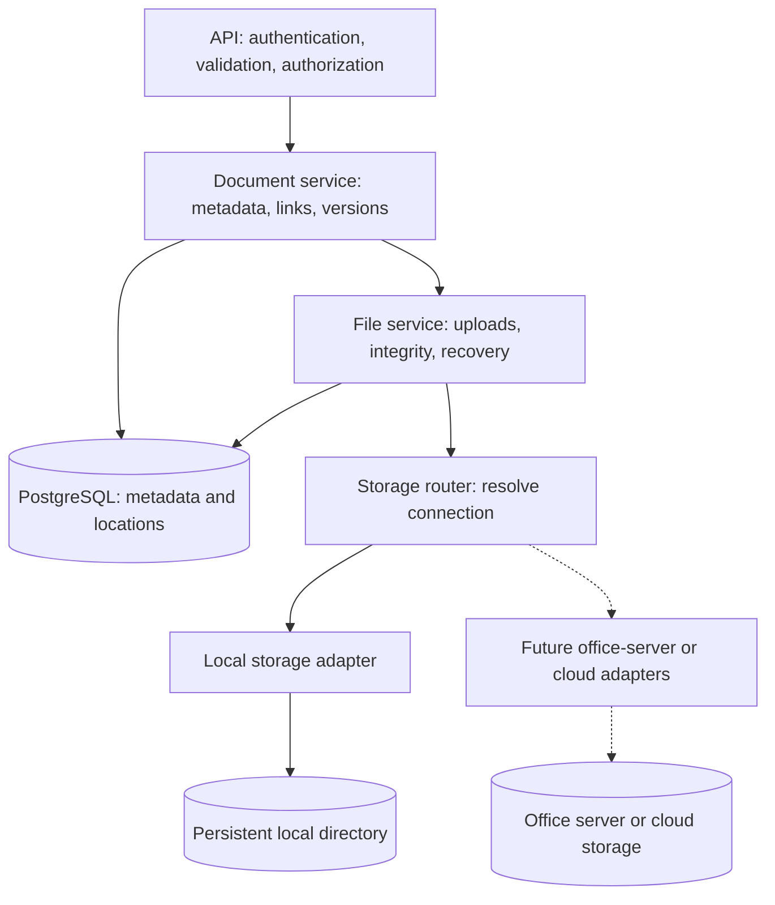

# Document and file storage architecture

Status: proposed architecture; this document does not claim implementation.
Scope: NestJS backend, Prisma, the existing single PostgreSQL database, and workspace-scoped storage. First release implements local storage only.

## Purpose

Support documents linked to cases and clients while allowing each office to use a different storage destination later. Document identity, version history, permissions, and relationships must survive storage changes.

PostgreSQL stores metadata. Storage providers store file bytes. A workspace remains the law-office boundary; this design does not introduce separate tenant databases.

## Layers

| Layer | Responsibility |
| --- | --- |
| API | Authenticated document endpoints, request validation, upload limits, workspace and case/client authorization, safe download responses. |
| Document service | Document titles, case/client links, versions, current-version selection, archive/restore, and activity logging. |
| File service | Generated file keys, streaming uploads, SHA-256 and byte counts, lifecycle state, retries, reconciliation, and coordinated cleanup. Reusable by chat attachments and exports. |
| Storage router | Resolve the workspace default for new uploads; resolve the recorded file connection for reads. Dispatch to the configured adapter. |
| Storage adapter | Write, read, inspect, and delete file bytes using a particular protocol. No case/client business logic. |
| Persistence | Durable metadata, upload state, file locations, and connection configuration. No file bytes in application tables for this design. |

## Core records

| Record | Essential information |
| --- | --- |
| Document | ID, workspace, title, optional case/client links, current version, creator, timestamps, archive state. |
| DocumentVersion | Document, unique version number within that document, stored-file ID, original filename, uploader, timestamp. |
| StoredFile | ID, workspace, detected content type, size, SHA-256, lifecycle state. File bytes are immutable after finalization. |
| FileLocation | File, connection, opaque relative storage key, state, verification time, and whether it is the active location. |
| StorageConnection | Workspace, provider type, configuration reference, enabled state. Workspace configuration selects a default connection. |

One document has many versions. A version references a stored file. A stored file may have several locations during migration, with one active location when available. For the first release, each new upload creates its own stored-file record; sharing bytes between document versions is deferred.

Enforce workspace consistency across all relationships, uniqueness of version numbers and connection/key pairs, and at most one active location per file. The current version must belong to the same document. Concurrent version creation must not produce conflicting version numbers or an incorrect current-version pointer.

## Local storage now

Configure an absolute `FILE_STORAGE_ROOT` directory on the machine running NestJS. Example generated key: `workspace-uuid/file-uuid/content`. Preserve the original filename in metadata, not in a user-controlled path.

The adapter combines its configured root with the internal key. Documents never store machine-specific absolute paths. In Docker, mount a persistent volume or host directory. Keep storage outside the repository and public web root. Do not expose it as static assets.

Restrict keys and path resolution to the configured root, including protection against traversal and symlink escapes. Use temporary files and finalize without overwriting existing content. Document the durability guarantees of the implementation; persistent volumes are not backups.

## Upload and download lifecycle

1. Authorize the request and validate links, metadata, and limits.
2. Create a pending upload/file record with an operation ID and generated key. Capture the selected connection for this upload.
3. Stream to temporary storage with bounded memory, enforcing byte limits and calculating SHA-256. Validate content type; do not trust filename extensions or browser MIME headers alone.
4. Apply required validation/scanning policy, then finalize the physical file without overwrite.
5. In a database transaction, mark the file/location available, create or finalize the document version, update the current version, and record the activity.
6. Return success only when the version is durably recorded as available.

Database transactions do not include filesystem writes. Persist enough operation state for reconciliation after a crash between these steps. Pending or failed uploads are not downloadable. Client retries need an idempotency policy; rejected or abandoned uploads require bounded cleanup. Cleanup must distinguish abandoned uploads from active transfers.

Downloads resolve an authorized document/version to its active location and stream through the API. Use a sanitized download filename. Do not return physical paths. An unavailable provider must not cause metadata deletion or an unannounced fallback to another destination.

## Rules that preserve data

- Adding a version never overwrites an existing version's bytes. Renaming changes metadata only.
- Archive/restore changes document visibility; it does not delete bytes. Permanent deletion and retention policy are deferred.
- Changing the default connection affects new uploads only. Existing files retain their recorded locations.
- Checksum equality detects practically identical bytes, not similar wording. The first release stores checksums; automatic deduplication is deferred. Any later duplicate suggestions must respect workspace and document permissions.
- Back up PostgreSQL and file storage together with a documented recovery procedure and restoration checks. Architecture alone cannot guarantee zero data loss.
- Preserve existing chat attachments. Inspect the current upload implementation before introducing shared services; do not silently relocate or invalidate existing files.

## Expansion later

Add an adapter implementing stream-based write/read, stat, and delete, with consistent error semantics. Optional provider capabilities such as signed URLs or multipart uploads stay outside the minimum contract. Office-server connectivity may need a private network or office-side connector; it is separate from document logic.

Migration is copy → verify size and SHA-256 → switch active location transactionally → retain old copy for recovery → controlled cleanup. Keep the old active location until verification succeeds. Migrations must resume safely and preserve document/version IDs. Do not build migration tooling in the first release.

Files already on an office server require a future discovery/import service. Files edited outside the app additionally require synchronization and conflict handling; basic storage adapters do not provide those workflows.

OCR, previews, and AI indexing are separate background processes tied to an exact version. Keep the original bytes regardless of processing success.

## First-release boundary

Deliver document APIs, metadata persistence, immutable versions, private streaming downloads, archive/restore, activity logs, the reusable file service, a connection router with LOCAL support only, local configuration, recovery/cleanup, and focused tests. Defer frontend work, external providers, external-folder synchronization, OCR/AI processing, physical deduplication, migration tooling, and permanent deletion.
