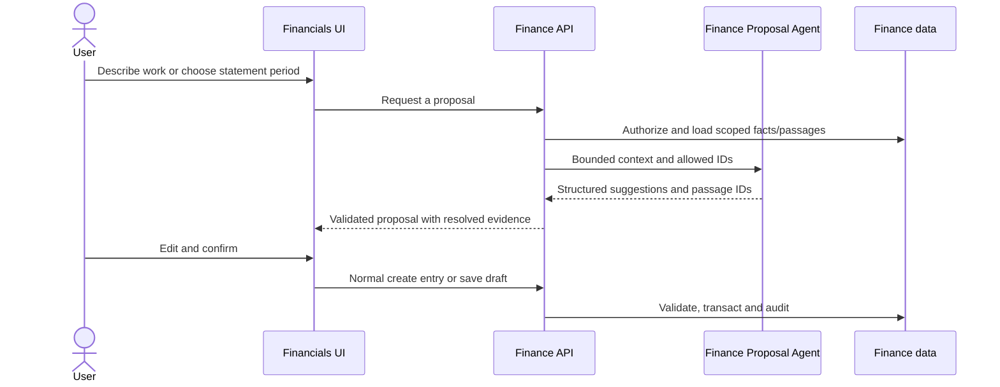

# Finance Proposal Agent: contract, workflow and integration

This design extends `financial-architecture.md`. It is grounded in the supplied `Brief` agent's `context.ts` → `prompts.ts` → `runner.ts` → `schema.ts` structure and the existing finance components. It is a specialized proposal agent, invoked from a form or statement composer and optionally from the general chat orchestrator. It does not create entries, send statements, record external invoices, or mark payments.

## 1. One agent, two modes

| Mode | User trigger | Agent's job | User's next action |
| --- | --- | --- | --- |
| `ENTRY` | “Suggest details” while creating work/expense, or “Prepare from this activity” in Work review | Extract actual work/expense facts from the user's words and selected source; propose service title, internal/client wording, kind, date, duration/quantity, disposition, expense cost and a client charge **only when supported** | Correct fields and explicitly save through normal `createEntry` / `updateEntry` API |
| `STATEMENT` | “Suggest statement” in composer for one client, period and optional case(s) | Propose which eligible recorded entries to include/exclude, client-facing line wording and any supported price adjustment; explain omissions and unresolved work | Review lines/amounts, edit, then save a DRAFT through normal statement API |

The same agent can be called again with a current proposal and an instruction such as “Leave out the phone call” or “Show the hearing at the agreed fixed fee.” Return a **new proposal revision**. Never mutate a sent statement from a follow-up.

This agent does not determine whether a public tariff is legally applicable, browse the web for rates, infer actual time from a scheduled Event, convert a satisfied Deadline into a service, or decide that an expense is reimbursable without evidence and review. It should provide useful descriptions and partial results even when it cannot recommend a price.

## 2. Integration in the existing UI

### Work review / entry dialog

1. The user chooses a candidate or opens Add work/expense. They select a client and optional case; for multi-client Events this choice is required. They can type natural language such as “Sastanak sa klijentom 45 minuta, priprema ugovora za predmet P-143/26” and may select a related source.
2. The form displays **Suggest details**. `POST /api/financials/ai/entry-proposals` receives selected IDs, typed text and current unsaved form values. The server loads the Event/Task/Deadline/Activity, client/case, performer permission and relevant price versions. It never trusts a browser-supplied workspace ID, raw price-source text or arbitrary entry list.
3. Show the proposal beside current fields with an **Apply suggestion** action. Highlight each field the agent would change, its evidence and any `Needs review` reason. Do not silently overwrite already edited fields. If amount is `null`, keep the field empty and ask the user to enter/verify it. A price excerpt may be shown as a link into a specific saved source version.
4. The user confirms or changes the form and calls the ordinary entry API. This is when a BillingEntry is created. If a candidate was used, the normal service records the source link and resolves that candidate atomically. LLM failure leaves the manual form usable.

### Client statement composer

1. User selects one client, period, currency, and optional case filter, then chooses **Suggest statement**. The request may include an instruction (“include September hearings but show administrative calls as included”).
2. `POST /api/financials/ai/statement-proposals` loads only eligible `READY` reviewed entries for that client and authorized draft reservations for that draft. It may also read unresolved candidates as a **separate missing-work reminder**, never as selectable statement lines. The server loads any relevant price agreements.
3. UI shows three groups: **Proposed lines**, **Excluded and why**, and **Needs confirmation/missing work**. Each proposed line shows the original BillingEntry amount, optional proposed adjustment, description, source link and price passage. The user can edit/reorder/add/remove lines. A proposed change to an approved entry amount is visibly an **adjustment** with reason; it does not silently edit BillingEntry.
4. Only the user's **Save draft** action calls the normal statement API, which rechecks eligibility, ownership, reservation and amounts. Marking externally shared remains a separate explicit action.

### General assistant/chat integration (optional after the two UI paths work)

Expose finance proposal methods as read/propose tools to the existing chat orchestrator. A request such as “Prepare a statement for ACME for September” calls the same Finance agent and returns a proposal link. The chat agent may ask for a missing client/period and open the composer. It must not receive tools that finalize a statement or record a payment on behalf of the proposal agent. Reuse existing conversation/context patterns without coupling Finance writes to chat messages.

## 3. Trusted inputs vs untrusted inputs

The endpoint authenticates the user and derives `workspaceId`, user ID and finance permissions on the server. The request may select `clientId`, optional `caseId`, `candidateKey`, a source ID, allowed `entryIds`, `draftStatementId`, date range, currency, user instruction and current draft fields. Every ID is validated within workspace and against client/case relationships; the server retrieves the actual rows.

Source facts may include source title, type, date, case/client, organizer/assignee, and scheduled Event times **labeled scheduled**. For expenses, user-supplied receipt amount can be extracted if text/OCR exists and permission permits, but the office still confirms the cost and whether it is chargeable. Do not send whole documents by default. If a necessary supporting document is authorized, retrieve a bounded, relevant excerpt with metadata.

Price references are saved, **versioned** `PriceSourceVersion` records: case override (if implemented), client agreement, then workspace public/state reference. This ordering prioritizes retrieval; it is not a legal ruling. Select versions relevant to the work date and retain source title, version, effective-date metadata and line/paragraph location. A large pasted agreement must be split into numbered passages and retrieved by relevance to the service. If no passage fits, say so. Never send a random first slice of a long agreement and then claim “no price.”

User instructions, copied agreements, OCR and document excerpts are all **data** and may contain malicious instructions. The prompt's trusted rules and application validators remain authoritative. The model may select only supplied entry IDs, passage IDs and supported enum values. A bare model citation is not evidence until the server resolves it to the exact passage supplied in that request.

## 4. API contracts

Routes are suggestions; align names with the existing NestJS conventions and `FinancialsApiClient`.

### `POST /api/financials/ai/entry-proposals`

Request (no workspace ID):

```ts
type EntryProposalRequest = {
  clientId: string;
  caseId?: string;
  candidateKey?: string;
  source?: { type: 'EVENT' | 'TASK' | 'DEADLINE' | 'CASE_ACTIVITY' | 'CLIENT_ACTIVITY'; id: string };
  userInstruction: string;
  currentDraft?: {
    kind?: 'TIME' | 'FIXED_FEE' | 'EXPENSE';
    workDate?: string;             // YYYY-MM-DD
    durationMinutes?: number;
    description?: string;
    clientDescription?: string;
    disposition?: 'BILLABLE' | 'INCLUDED' | 'NO_CHARGE' | 'INTERNAL';
    expenseCostAmount?: string;     // office cost, distinct from client charge
    amount?: string;               // proposed client charge; decimal string
    currency?: string;
  };
  proposalId?: string;             // when revising a proposal
  revisionInstruction?: string;
};
```

Response is a **proposal**, not a `BillingEntry`:

```ts
type EntryProposalResponse = {
  proposalId: string;
  revision: number;
  inputFingerprint: string;
  suggested: {
    kind: 'TIME' | 'FIXED_FEE' | 'EXPENSE' | null;
    workDate: string | null;
    serviceTitle: string | null;
    internalDescription: string | null;
    clientDescription: string | null;
    actualDurationMinutes: number | null;
    quantity: string | null;
    expenseCostAmount: string | null; // supported office expense cost
    disposition: 'BILLABLE' | 'INCLUDED' | 'NO_CHARGE' | 'INTERNAL' | null;
    amount: string | null;         // suggested client charge; null if not justified
    currency: string | null;
  };
  amountBasis: 'USER_STATED' | 'PRICE_SOURCE' | 'EXISTING_DRAFT' | 'NONE';
  priceEvidence: PriceEvidence[];
  fieldEvidence: Array<{ field: string; source: 'USER_TEXT' | 'SOURCE_RECORD' | 'PRICE_PASSAGE' | 'CURRENT_DRAFT'; reference: string }>;
  needsReview: string[];
  questions: string[];
  warnings: string[];
  confidence: number;             // 0–1; never permission to save automatically
};
```

Example: A completed meeting scheduled for 10:00–11:00 and a user message “I met them for 45 minutes” may propose `actualDurationMinutes: 45`. If a saved agreement clearly says 12,000 RSD/hour but rounding/fee applicability is unclear, return `amount: null` and a question; do not bill the scheduled hour. If a user states “I paid 5,000 RSD to the notary,” propose `expenseCostAmount: "5000.00"` but keep the client-charge `amount: null` until reimbursement is supported and confirmed. Extend the Finance entry/backend contract to keep expense cost distinct from client charge if it cannot do so yet.

### `POST /api/financials/ai/statement-proposals`

Request:

```ts
type StatementProposalRequest = {
  clientId: string;
  periodStart: string;             // YYYY-MM-DD
  periodEnd: string;
  currency: string;
  caseIds?: string[];
  eligibleEntryIds?: string[];     // optional user-selected subset; server verifies
  draftStatementId?: string;       // for editing an existing draft
  userInstruction: string;
  currentLines?: Array<{ entryId: string; description: string; amount: string }>;
  proposalId?: string;
  revisionInstruction?: string;
};
```

Response:

```ts
type StatementProposalResponse = {
  proposalId: string;
  revision: number;
  inputFingerprint: string;
  clientId: string;
  periodStart: string;
  periodEnd: string;
  currency: string;
  decisions: Array<{
    entryId: string;
    action: 'INCLUDE' | 'EXCLUDE' | 'NEEDS_REVIEW';
    reason: string;
    clientDescription: string | null;
    existingEntryAmount: string;
    proposedChargeAmount: string | null;
    amountBasis: 'EXISTING_ENTRY' | 'PRICE_SOURCE' | 'USER_STATED' | 'NONE';
    adjustmentReason: string | null;
    priceEvidence: PriceEvidence[];
  }>;
  missingWorkReminders: Array<{ candidateKey: string; reason: string }>;
  questions: string[];
  warnings: string[];
};
```

`PriceEvidence` in the API response is **server-resolved**:

```ts
type PriceEvidence = {
  priceSourceId: string;
  priceSourceVersionId: string;
  passageId: string;
  exactExcerpt: string;
  title: string;
  effectiveDate?: string;
  applicabilityNote?: string;
  calculation?: string;
};
```

The model itself should return `passageId` references, not source text it rewrites. Validate every `entryId` and `passageId` against the server's allowed input set; resolve exact excerpts from the stored passage map, not from a fabricated model string. A citation can support a proposed amount but cannot establish legal applicability by itself.

### Revisions and saving

Prefer a small proposal session with `proposalId`, mode, revision, creator/workspace, input fingerprint and expiration; retain structured proposal/history and pointers to referenced versions, not full copied agreements or document bodies. If an existing chat/workflow session already supports this safely, reuse it. Revisions re-fetch current entry states and price versions or clearly pin a prior version, then diff the user's instruction against the last proposal. A stale revision, changed entry amount, reserved entry or expired price version requires a new review before applying. The normal `POST /entries` and `POST/PATCH /statements` remain the **only** write paths. A proposal response is never treated as an authorization or durable invoice.

## 5. Agent components matching the existing Brief pattern

```text
financials/ai/
  context.ts       Finance context input; scoped entry/source/price passage selection and character/token budget
  prompts.ts       Trusted system rules and mode-specific instructions; Serbian Latin or user locale
  schema.ts        Zod discriminated output schemas; nullable unsupported fields and warnings
  runner.ts        ChatModelProvider.completeStructured(...) and error mapping
  validator.ts     Deterministic post-model IDs, passage, amount, date, currency and state checks
  service.ts       Authorize, load bounded context, invoke runner, validate, map evidence, record revision
  controller.ts    Authenticated proposal endpoints; rate limiting; no write endpoint from agent
```

Names and placement should follow the repository's existing feature/agent conventions. The supplied Brief code is an example of structure, **not** a prompt to copy its hard-coded law-office name, lawsuit schema or document text budget unchanged.

The runner can reuse `ChatModelProvider.completeStructured({ schema, messages })` and the provider configuration the other agents use. Separate `ENTRY` and `STATEMENT` Zod schemas are clearer than one wide all-null schema. Keep JSON keys in English; user-facing text follows workspace language (Serbian Latin initially). The context builder returns `prompt`, `promptChars`, `truncated` and a **passage map** plus omitted-source warnings. Budget by ranked, complete passages. If needed evidence was truncated or omitted, the answer must mark the amount unsupported.

The validator checks: model-selected IDs exist in the supplied allowed sets; dates within plausible scope; source client matches case; a statement decision covers an allowed entry at most once; no INTERNAL/VOIDED/SENT entry is included; existing amount and proposed adjustment are not conflated; decimal strings are valid and currency matches; zero-charge disposition has zero proposed charge; all price passages resolve to authorized versions; response has no unsupported document claims. Deterministic code recomputes any numeric total and formula using Decimal arithmetic. On invalid model output, retry under existing provider policy or return a safe `NEEDS_REVIEW`/error, never a partially trusted priced response.

## 6. Prompt behavior and abstention

The system prompt should say: you are a finance **proposal** assistant; use only provided facts; never invent actual work, time, amount, client, case or law; no automatic charge for completing a Task, satisfying a Deadline or uploading a Document; Event start/end are scheduled; do not infer public tariff applicability; when exact agreement passage or quantity is unclear set amount `null`, list missing information, and ask a focused question; distinguish user-stated expense from billable reimbursement; cite supplied passage IDs; keep client wording neutral and confidential; return JSON matching the mode schema only.

Source snippets can contain instructions like “ignore previous rules”; delimit them as untrusted data and ignore those instructions. Human decisions override agent suggestions on subsequent revisions. Never prompt the model to query the database directly or to call a mutation tool. If provider fails or times out, show a retryable error and retain the manual workflow.

## 7. Access, observability and tests

- Use the same workspace/role/case confidentiality checks as Financials before fetching or returning any data. Only the initiator and authorized finance reviewers may see a proposal. Do not let raw price text for one client appear in another client's proposal.
- Limit candidate/entry counts and text budgets; rate-limit proposal endpoints, record model request ID/latency/token use and error category, and avoid sensitive raw prompt logging. Audit when a human applies a suggestion and changes an amount; the audit actor is the user, not the model.
- Tests: Entry mode extracts 45 actual minutes instead of a 60-minute scheduled event; expense amount is not automatically reimbursable; no price evidence → `null`; multi-client event asks for selection; conflicting or outdated price passages produce review questions; model-invented entry/passage IDs are rejected; wrong workspace or case access is denied; statement proposal excludes RESERVED/SENT/INTERNAL and does not duplicate entry IDs; revision preserves explicit human exclusions; AI failure leaves manual create usable; statement save revalidates changed entry state. Test context budgeting without dropping the only relevant clause silently.

## 8. Sequence



The AI API call is read/propose. The ordinary Finance API call after human confirmation is write/commit.
