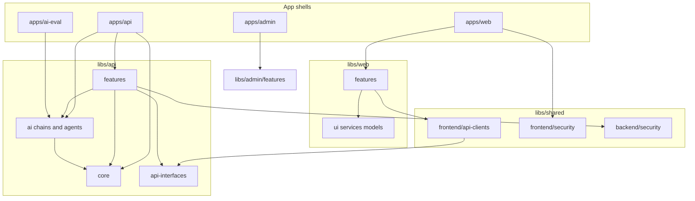

# Project Structure Blueprint

A TypeScript Nx monorepo for an API, two Angular clients, and AI agents. Copy this as inspiration for a new FE / BE / AI workspace. Names here (`api`, `web`, `admin`, `@org`) are placeholders — replace them with yours.

---

## 1. Purpose

Thin **app shells** compose **feature libraries**. Shared DTOs are the contract between clients and the API. AI lives in its own libs (one chain or agent per library) and is called from the API — never from the UI directly. Delivery work, product knowledge, and coding-agent rules sit beside the code so humans and agents share one source of truth.

---

## 2. Tech stack

| Layer                | Choice                                           |
| -------------------- | ------------------------------------------------ |
| Language             | TypeScript                                       |
| Monorepo             | Nx                                               |
| API                  | NestJS (Node.js)                                 |
| Clients              | Angular (standalone, SCSS, Tailwind)             |
| Database             | PostgreSQL + Prisma                              |
| Cache / realtime     | Redis                                            |
| Object storage       | S3-compatible blob store                         |
| AI orchestration     | LangChain / LangGraph                            |
| LLM providers        | OpenAI, Google GenAI                             |
| Optional prototyping | Low-code workflow engine (webhooks into the API) |
| Search               | Elasticsearch (lexical + kNN)                    |
| Feature flags        | External flag service                            |
| Notifications        | External notification service                    |
| API docs             | Swagger / OpenAPI                                |
| Observability        | APM agent                                        |
| CI                   | Pipeline + Nx cache                              |

Update the stack document **before** introducing a new technology.

---

## 3. Top-level tree

```
.
├── apps/                    # Deployable applications only
│   ├── api/                 # NestJS API + Prisma
│   ├── web/                 # Primary Angular app
│   ├── admin/               # Angular admin app
│   └── ai-eval/             # LangSmith / eval runner (not user-facing)
├── libs/
│   ├── api/                 # Backend domain, core, AI, DTOs
│   ├── web/                 # Primary-app features and UI
│   ├── admin/               # Admin-app features and UI
│   └── shared/              # Cross-app backend + frontend + TS utils
├── delivery/                # Engineering source of truth (tracks, styleguides)
├── docs/                    # Product / company knowledge base (not owned by eng)
├── infra/                   # Cluster values, monitoring
├── scripts/                 # Operator / CI TypeScript utilities
├── .agents/rules/           # Always-on coding-agent rules
├── nx.json
├── tsconfig.base.json       # Path aliases
└── package.json
```

---

## 4. Dependency flow



**Rules**

- Apps import libs. Libs never import apps.
- `web` / `admin` talk to the API only through `*ApiClient` classes and `api-interfaces` DTOs.
- Feature libs do not import other apps. Cross-feature imports are allowed only when lint permits; prefer shared DTOs or `core`.
- Path alias: `@org/<scope>/<area>/<lib>` → `libs/<scope>/<area>/<lib>/src/index.ts`.

---

## 5. Apps (thin shells)

### `apps/api`

Composition root. Boots Nest, Swagger, global pipes/guards, and imports feature modules. Prisma schema, migrations, and seeds live here.

```
apps/api/
├── prisma/
│   ├── schema.prisma
│   ├── migrations/
│   └── seeds/
└── src/
    ├── main.ts
    ├── starter.ts          # NestFactory, global prefix `api`
    └── app/app.module.ts   # sole composition root
```

`AppModule` imports platform modules (`Config`, `Http`, cache, events, schedule), shared security, `ApiCoreModule`, `AiCoreModule`, the assistant module, then one `ApiFeature*Module` per domain.

### `apps/web` and `apps/admin`

Bootstrap loads `/config.local.json` then `/config.json`, provides it as a DI token, and lazy-loads feature routes.

```
apps/web/
├── public/config.json
└── src/
    ├── main.ts
    ├── app/
    │   ├── app.config.ts
    │   ├── app.routes.ts
    │   └── app.component.ts
    └── locale/             # messages, messages.zh-CN, messages.ja
```

Routing: `loadChildren` to `@org/web/features/<name>`. Guards stack as auth → product → legal / onboarding → **feature flag + role**. Admin is the same pattern with a thinner guard stack.

### `apps/ai-eval`

Node runner for chain quality (LangSmith / OpenEvals). Not a product surface. Invoke with `nx run ai-eval:eval`.

---

## 6. Library scopes

### `libs/api` — backend domain + AI

| Area              | Role                                                             |
| ----------------- | ---------------------------------------------------------------- |
| `features/<name>` | One Nest module per domain (HTTP, use-cases, jobs)               |
| `ai/<name>`       | One chain or agent per lib                                       |
| `core`            | Prisma client wrapper, search, files, flags, jobs, notifications |
| `api-interfaces`  | Request/response DTOs (class-validator + Swagger)                |
| `shared`          | Backend models used by several features                          |

Example feature names: `workspace`, `catalog-item`, `chat`, `workflow`, `user`, `company`, `dashboard`.

### `libs/web` — primary client

| Area              | Role                                        |
| ----------------- | ------------------------------------------- |
| `features/<name>` | Lazy-loaded routes, pages, feature services |
| `ui`              | App-level layout, menus, cards, dialogs     |
| `services`        | Auth, user data, flags, listing managers    |
| `models`          | View models                                 |
| `utils`           | Config token, helpers                       |

### `libs/admin` — admin client

`features/<name>` + `ui`. Same lazy-load pattern as `web`.

### `libs/shared`

| Area                                    | Role                                           |
| --------------------------------------- | ---------------------------------------------- |
| `backend/security`                      | Auth guards, public-route decorator            |
| `backend/api-clients`                   | Server-to-server HTTP clients                  |
| `backend/services`                      | Shared Nest services                           |
| `frontend/api-clients`                  | `HttpClient` wrappers (`inject(API_URL)`)      |
| `frontend/security`                     | Interceptors (auth, retry, i18n), route guards |
| `frontend/services`                     | Listing manager, translation, analytics        |
| `frontend/ui`                           | Design primitives                              |
| `frontend/components`                   | Typography, editors                            |
| `frontend/pipes`, `directives`, `utils` | Cross-app FE helpers                           |
| `ts`                                    | Framework-agnostic TypeScript                  |

---

## 7. Backend feature recipe

**Layering:** controller → use-case (or service) → Prisma / `core`. No business logic in controllers. Use-cases return explicit types from `execute()` — never `Promise<any>`. Controllers pass model types; the service is the mapping boundary to Prisma types.

```
libs/api/features/workspace/src/lib/
├── api-feature-workspace.module.ts
├── workspace.controller.ts
├── use-cases/
│   ├── create-workspace.use-case.ts
│   └── list-workspaces.use-case.ts
├── listeners/              # optional @OnEvent side effects
├── jobs/                   # optional scheduled / distributed jobs
├── workers/                # optional async work units
└── workspace.repository.ts # optional; most features inject PrismaService
```

Repositories are optional. Add one when persistence is complex. Dedicated repos are the exception; injecting `PrismaService` from `@org/api/core` is the default.

**Checklist — new backend feature**

1. Generate an Nx library under `libs/api/features/<name>`.
2. Add path alias in `tsconfig.base.json`.
3. Copy `.eslintrc.json` from a sibling lib.
4. Export a Nest module from `src/index.ts`.
5. Put DTOs in `libs/api/api-interfaces/src/lib/<name>/` (`*-request.dto.ts`, `*-response.dto.ts`) and re-export from the barrel.
6. Register the module in `apps/api` `AppModule`.
7. Pair `@IsString()` with `@IsNotEmpty()` on required strings; `@IsOptional()` on optional fields.

---

## 8. Frontend feature recipe

Each feature is an Nx lib with `lib.routes.ts` and a barrel.

```
libs/web/features/library/src/
├── index.ts
└── lib/
    ├── lib.routes.ts              # export featureLibraryRoutes
    └── library/
        ├── library.component.ts
        ├── library.service.ts     # wraps *ApiClient + listing manager
        └── ...
```

**Layering:** component → feature / `web` service → shared `*ApiClient` → Nest. DTOs come from `@org/api/api-interfaces`.

Use `input()` / `output()` / `signal()` / `computed()`. Do not call methods in templates to derive state. Wrap user-visible strings with `$localize`.

**Checklist — new frontend feature**

1. Generate an Nx Angular library under `libs/web/features/<name>` (or `libs/admin/...`).
2. Add path alias; copy `.eslintrc.json`.
3. Export routes from `src/index.ts`.
4. Lazy-load from `apps/web` `app.routes.ts` with auth + feature-flag guards.
5. Add an `*ApiClient` in `libs/shared/frontend/api-clients` if the endpoint is new.
6. Register HTTP context so background calls do not drive the loading bar.

**Listing pattern:** a listing manager rebuilds view-models whenever the entity list is reassigned and clears selection. Re-apply selection after mutations. Keep the sidebar filter broad; use a separate narrow filter for auto-select.

**Global assistant panel:** lazy-mount only when the panel is open so each open gets a fresh instance. Root services that persist across opens must own re-init of pending messages and scope.

---

## 9. AI layer recipe

Each capability is its own Nx lib under `libs/api/ai/<name>/`, imported as `@org/api/ai/<name>`.

### Simple chain

```
libs/api/ai/query-classifier-chain/src/lib/
├── chain.ts       # RunnableSequence + Zod schema
├── prompts.ts
└── index.ts
```

### Multi-variant extraction

One directory per variant (`invoice/`, `receipt/`, …), each with `chain.ts`, `prompts.ts`, `schema.ts`, optional `examples.ts`.

### Assistant (agent)

```
libs/api/ai/assistant/src/lib/
├── assistant.module.ts
├── assistant.controller.ts
├── agent.ts
├── tools/             # LangChain tools
├── skills/*/SKILL.md
├── routing/           # use-case gate / router
├── services/          # stream manager, thread registry
├── use-cases/
└── prompts/
```

Wire `AiCoreModule` + the assistant module in `AppModule`. Put eval cases in `apps/ai-eval`.

**LLM context is a data surface.** Anything injected into a prompt or returned by a tool must pass the same authorization checks as a regular API response. The model is not a trust boundary. Workspace-scoped tools authorize in the tool itself — do not reach across feature modules for that check.

**Streaming**

| Kind                                    | Pattern                                                                    |
| --------------------------------------- | -------------------------------------------------------------------------- |
| Long-running jobs (discovery, monitors) | Persist run events to Postgres, emit in-process events, UI polls task list |
| Chat / assistant                        | Reconnectable HTTP UI-message stream (`pipeUIMessageStreamToResponse`)     |
| Legacy chat                             | Nest SSE + RxJS `Observable<MessageEvent>`                                 |

---

## 10. Cross-cutting

**Prisma** lives at `apps/api/prisma`. Generated client is wrapped by `PrismaService` in `libs/api/core`. Domain JSON column shapes are typed next to that wrapper, not in features. `build` / `serve` depend on `prisma-generate`.

**Runtime config** — `public/config.json` (`apiUrl`, `wsUrl`, flag SDK key, analytics). Local override: `config.local.json`.

**Feature flags** — SDK key from config; targeting by user id / email / company. Routes use a flag guard composed with `logicalAnd` / `logicalOr`. UI uses `isFeatureEnabled` → `toSignal` / async pipe.

**i18n** — `@angular/localize`, locale URL prefixes (`/en/`, `/zh-CN/`, `/ja/`). HTTP interceptor appends `?lang=`. Extract with an Nx `extract-i18n` target.

**Background work** — `Worker` subclasses + a work orchestrator in `core`. Features register workers; do not spawn ad-hoc processes.

**Notifications** — dispatch from listeners after domain events, not from controllers.

**Security**

- Never load an entity by ID alone. Scope to the caller (user / company / connected network).
- IDs in request bodies are untrusted. Validate shape in the DTO, then access in the use-case.
- Route guards prove the user can hit the endpoint, not that they own every ID in the body.
- Filter in the Prisma `where` clause so unauthorized rows are never loaded.
- Array ID fields must be intersected with the caller’s accessible set before use.

---

## 11. Delivery system

Engineering work is tracked in `delivery/`. Product owns `docs/`. Agents read both.

```
delivery/
├── index.md                 # Entry: product, stack, workflow, tracks
├── product.md
├── product-guidelines.md    # Voice, UX principles
├── tech-stack.md            # Update BEFORE changing tech
├── workflow.md              # Track lifecycle and commit protocol
├── tracks.md                # Registry of all tracks
├── code_styleguides/        # Long-form style (Nest, Angular, TS, security, HTML/CSS)
└── tracks/
    └── <track_id>/
        ├── index.md
        ├── spec.md          # What and Why only
        ├── plan.md          # How — tasks with checkboxes
        └── metadata.json
```

### Track files

`spec.md` is product/UX. `plan.md` is implementation. Never mix them.

```json
{
  "track_id": "workspace_share_20260325",
  "parent_track_id": "workspace_collaboration_20260209",
  "type": "feature",
  "status": "pending",
  "prd_reference": "docs/product/product-requirements/workspace/share-prd.md",
  "created_at": "2026-03-25T00:00:00Z",
  "updated_at": "2026-03-25T00:00:00Z"
}
```

Types: `epic` | `feature` | `fix` | `chore`. Status: `pending` | `in_progress` | `done`.

Every new track folder must contain all four files. Register the track in `tracks.md` under its parent.

### Task lifecycle

In `plan.md`: `[ ]` → `[~]` (before starting) → `[x] <7-char-sha>` (after the implementation commit). Do not batch status updates.

After the code commit, update the track and commit separately (`docs(delivery): ...`).

### PRD ↔ track linking

- Track `metadata.json` has `prd_reference`.
- Track `spec.md` opens with `> **Source PRD:** [Title](relative/path)`.
- PRD has a **Delivery Tracks** table (track id, type, status, link) before revision history.

A track without a PRD link, or a PRD without that table, is incomplete.

### Git

Commits: `<type>(<scope>): <description>` — `feat`, `fix`, `docs`, `style`, `refactor`, `test`, `chore`.

Branches: `feature/<track_id>`, `hotfix/<short>`, `docs/<short>`, `chore/<short>`.

Format before commit. Attach a git note with the task summary after each commit.

---

## 12. Product knowledge base

`docs/` is owned by product, marketing, and leadership. Engineers and agents **read** it; they do not treat it as a code dump.

```
docs/
├── README.md
├── CONVENTIONS.md
├── company/                 # Vision, mission, strategy
├── product/
│   ├── roadmap.md           # Live summary of delivery track statuses
│   ├── strategy/            # Vision, ICP, value proposition
│   ├── archetypes/
│   ├── participants/
│   └── product-requirements/
│       └── <domain>/
│           └── <feature>/
│               └── <feature>-prd.md
├── marketing/
├── processes/
├── operations/              # Meetings, decisions, OKRs
└── templates/               # PRD, decision log, meeting notes, release note
```

When starting a feature: read the PRD first. It is the source of truth for **what** and **why**. Then create or update a delivery track for **how**.

PRD sections to expect: problem, goals, non-goals, user stories, functional requirements, acceptance criteria, delivery-tracks table, revision history.

---

## 13. Agent rules

Short always-on rules live in `.agents/rules/` and are referenced from a root agent guide. Long form lives in `delivery/code_styleguides/`.

**Workflow**

- After every implementation commit, update `plan.md` / `metadata.json` / `tracks.md` immediately.
- Change tech only after updating `tech-stack.md`.

**General**

- Prefer the simplest solution that matches existing patterns.
- Do not add features, refactors, or comments beyond what was asked.
- Comments only when they state a non-obvious constraint or a why the code cannot express.
- Every `catch` / Observable `error` must log with operation name and ids. Never swallow.

**TypeScript**

- Named exports only. No `any`, no unjustified `as`, no `var`, no default exports.

**NestJS**

- Controller → use-case → persistence. Explicit return types on `execute()`.

**Angular**

- `input()` / `output()` / `signal()` / `computed()`. `afterNextRender` instead of `setTimeout(0)` for DOM waits.

**Security**

- Scope every entity load. Re-check body IDs in the use-case. Authorize AI tools before the model sees data.

---

## 14. How to add a new one

| You need                           | Create                                                 | Do not create                                           |
| ---------------------------------- | ------------------------------------------------------ | ------------------------------------------------------- |
| New HTTP domain                    | `libs/api/features/<name>` + DTOs + `AppModule` import | A new Nest app                                          |
| New screen in the primary client   | `libs/web/features/<name>` + lazy route                | Logic inside `apps/web`                                 |
| New admin screen                   | `libs/admin/features/<name>`                           | A copy of a `web` feature                               |
| New LLM capability                 | `libs/api/ai/<name>` (+ eval in `apps/ai-eval`)        | Prompts inlined in a feature service                    |
| Shared widget used by both clients | `libs/shared/frontend/ui` or `components`              | Duplicated components in `web` and `admin`              |
| New deployable process             | `apps/<name>`                                          | A lib that needs its own process, port, or Docker image |
| New delivery work item             | `delivery/tracks/<id>/` (all four files) + `tracks.md` | A track missing `spec.md` or `metadata.json`            |

### Nx library steps (every new lib)

1. Generate with the Nx plugin for the stack (Nest lib or Angular lib).
2. Add `@org/...` path in `tsconfig.base.json` pointing at `src/index.ts`.
3. Copy `.eslintrc.json` from a sibling.
4. Export a barrel from `src/index.ts`.
5. Import the barrel from the app or the consuming feature — never deep-import `src/lib/...`.

### Useful commands (adapt names)

```bash
nx run api:serve
nx run web:serve
nx run admin:serve

nx run api:prisma-generate
nx run api:prisma-migrate
nx run api:prisma-seed --script=<path>

nx run <project>:lint
nx run <project>:test
CI=true nx run <project>:test

nx run-many -t lint
nx graph
```

Root scripts typically wrap serve / build / format / `prisma-generate` on postinstall.

---

## Alias cheat sheet

```
@org/api/features/workspace          → libs/api/features/workspace/src/index.ts
@org/api/ai/query-classifier-chain   → libs/api/ai/query-classifier-chain/src/index.ts
@org/api/core                        → libs/api/core/src/index.ts
@org/api/api-interfaces              → libs/api/api-interfaces/src/index.ts
@org/web/features/library            → libs/web/features/library/src/index.ts
@org/web/ui/*                        → libs/web/ui/src/index.ts
@org/admin/features/catalog          → libs/admin/features/catalog/src/index.ts
@org/shared/frontend/api-clients     → libs/shared/frontend/api-clients/src/index.ts
```
